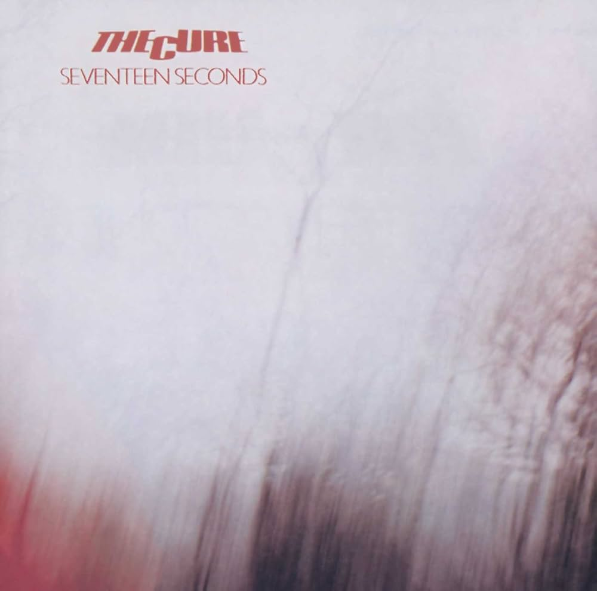

+++
date = '2025-02-20T18:30:17+01:00'
draft = false
title = 'The Cure - Seventeen Seconds - 1980'
categories = ['Les 100']
tags = ['New Wave', 'Post-Punk', 'Goth Rock', 'Coldwave']
image = '/images/the-cure-seventeen-seconds.jpg'
+++

À ce jour, la liste de mes 100 disques préférés est plutôt maigre. Il me reste encore beaucoup de chemin à parcourir pour arriver aux 100. On continue donc avec cet album de The Cure, le deuxième du groupe sorti en 1980 et qui inaugure la fameuse trilogie "Seventeen Seconds", "Faith" et "Pornography".

Ce disque est très certainement celui du groupe que j'écoute le plus régulièrement. Cela date de 1989, date à laquelle j'ai pu obtenir une copie de cet album et ainsi me plonger sérieusement dans les 10 chefs-d'œuvre du disque. Cela faisait déjà quelques années que j'écoutais le groupe, depuis 1983 exactement lorsqu'un camarade de classe m'avait fait découvrir "Love Cats".

"Seventeen Seconds", c'est pour moi juillet 1989, ces 10 chansons en boucle dans mon walkman, le temps d'un trajet à 4 heures du matin pour me rendre sur le lieu de mon job d'été, au sud de Lyon. Depuis, dès les premières notes d'"A Reflection", je ressens cette ambiance matinale si particulière, cette torpeur de ces réveils trop matinaux, de la ville qui s'éveille. Je garde toujours cette impression que le disque joue avec moi par l'alternance de titres calmes et énergiques, me faisant passer au fil des morceaux d'un état de semi-somnolence à un état d'éveil soudain, comme si l'album était conçu pour maintenir mon attention en constant déséquilibre. Le plus étonnant est que plus de 30 ans après, je ressens les mêmes sensations.

Cet album ne sera pas le seul du groupe dans mes 100 disques préférés tant Robert Smith et ses acolytes ont occupé une place importante depuis que j'écoute de la musique. Pour des raisons différentes, l'album "Wish" a marqué mon parcours musical. Mais c'est une autre histoire que l'on verra plus tard.

[Discogs](https://www.discogs.com/fr/master/20278-The-Cure-Seventeen-Seconds)


