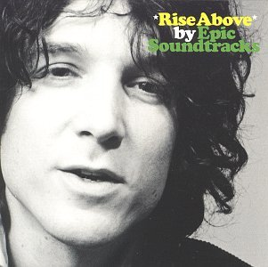

+++
date = '2025-02-26T18:30:17+01:00'
draft = false
title = 'Epic Soundtracks - Rise Above - 1992'
categories = ['Les 100']
tags = ['Pop Rock', 'Indie Rock']
image = '/images/epic-soundtracks-rise-above.jpg'
year = 1992
+++

L'année 1992 restera gravée dans les mémoires comme une année particulièrement prolifique en albums remarquables. On peut citer, entre autres, "Dirty" de Sonic Youth, "Dry" de PJ Harvey, "Automatic for the People" de R.E.M., "Slanted and Enchanted" de Pavement, et "La Fossette" de Dominique A. Cette liste pourrait s'allonger, mais ce n'est pas l'objet de ce texte. Je souhaite plutôt parler de l'album d'Epic Soundtracks, qui, plus de 30 ans plus tard, demeure mon préféré de cette année.

Lorsque ce disque est sorti, je dois avouer que je n'avais jamais entendu parler de cet artiste. Pourtant, il était déjà crédité sur de nombreux albums que j'écoutais régulièrement, comme ceux de Swell Maps, Crime & The City Solution ou These Immortal Souls. Epic Soundtracks est également le frère de Nikki Sudden, un autre artiste indispensable dans toute sélection discographique respectable.

L'album "Rise Above" regroupe 12 chansons magnifiques qui alternent entre ambiances calmes et passages plus énergiques. On se laisse envahir par la mélancolie qui se dégage de chaque morceau, envoûté par la douce voix d'Epic Soundtracks, le piano lancinant et les cuivres hypnotiques. Chaque titre conserve son identité propre, sublimé par la présence d'invités prestigieux tels que Lee Ranaldo, Kim Gordon, Jay Mascis, Martin P. Casey, ou Rowland S. Howard, pour ne citer que ceux qui me sont les plus familiers. On voit que nous ne sommes jamais très loin de la galaxie de Nick Cave et de ses Bad Seeds, ce qui explique en partie mon engouement pour ces compositions.

Epic Soundtracks ne s'est pas arrêté à cet album, et la suite de sa carrière discographique est tout aussi intéressante, bien que trop courte. Il nous a quittés en 1997, laissant derrière lui quatre albums solo et une multitude de collaborations avec des groupes qui ont marqué l'histoire de la musique.

[Discogs](https://www.discogs.com/fr/master/219095-Epic-Soundtracks-Rise-Above)



