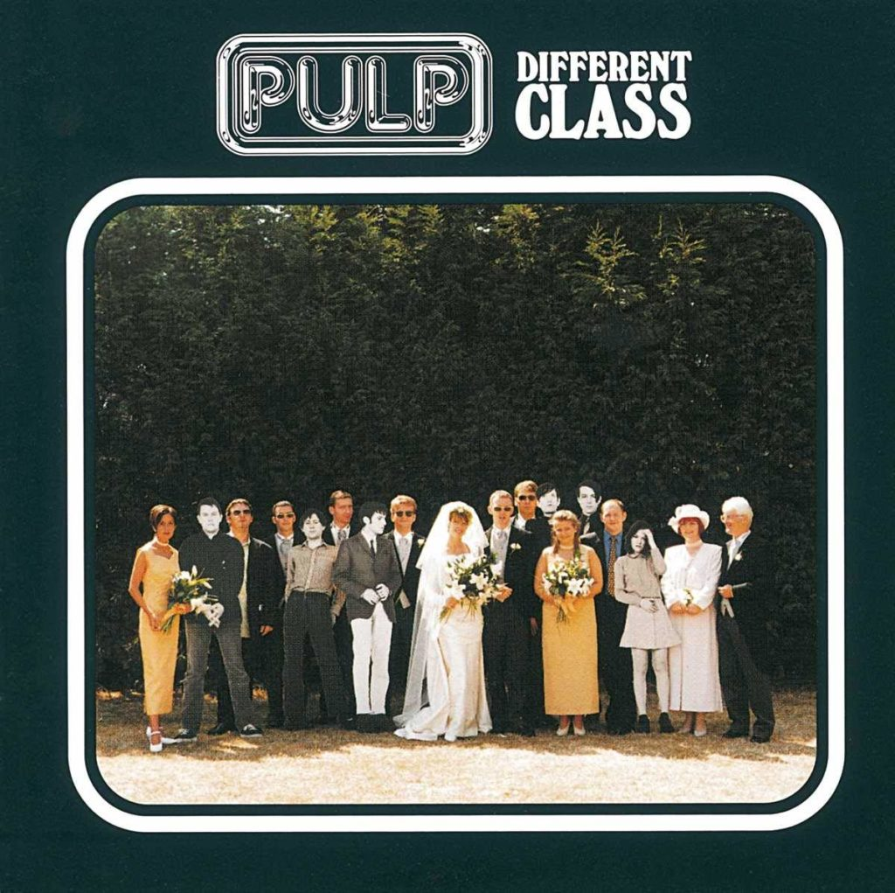

+++
date = '2025-02-27T18:30:17+01:00'
draft = false
title = 'Pulp - Different Class - 1995'
categories = ['Les 100']
tags = ['Alternative Rock', 'Britpop']
image = '/images/pulp-different-class.jpg'
year = 1995
+++

En cette journée d'annonce de la présence de Pulp à la Route du Rock, je ne pouvais pas faire autrement que d'intégrer un album du groupe dans ma liste de mes 100 disques préférés. Et oui, je ne rêve pas ! Pulp sera cette année à la Route du Rock pour leur seule date en France ! Je n'osais même pas en rêver. Trente ans après le dernier concert de Jarvis et sa bande auquel j'ai pu assister (le 27 novembre 1995 au Transbordeur), je vais enfin les revoir sur scène, et ce sera le 14 août à Saint-Malo. Certes, le groupe a payé un lourd tribut au temps (Steve Mackey, le bassiste, est décédé en 2023), mais je suis impatient de pouvoir réentendre en live quelques-uns de leurs refrains imparables.

Dans cette sélection de mes albums favoris, j'ai donc choisi d'intégrer "Different Class", le cinquième album du groupe paru en 1995. J'aurais pu choisir un autre disque de leur oeuvre tant j'apprécie ce groupe mais le choix de "Different Class" se fait avec une petite longueur d'avance sur "His 'n' Hers", l'album sorti en 1994. "Different Class", c'est tout de même "Common People", hymne de toute une génération qui nous a tous fait danser (même moi !) au milieu des années 90. Mais cet album ne se réduit pas à ce titre. On y retrouve "Disco 2000", autre titre majeur du groupe, ou encore "Mis-Shapes" et "Underwear", qui nous prouvent, si c'était encore nécessaire, que Jarvis est aussi à l'aise sur des morceaux enlevés que sur des chansons plus calmes.

Récemment encore, je regardais le film ["A Film About Life, Death & Supermarkets"](https://www.lesinrocks.com/musique/pulp-a-film-about-life-death-supermarkets-2-137038-02-09-2014/), consacré à la dernière tournée du groupe en 2012 et à leur retour dans leur ville d'origine, Sheffield. Au-delà de ce que représente le groupe dans cette ville, les voir sur la scène du Sheffield Arena chanter le titre "Common People" d'une seule voix avec le public reste un moment unique qui me fait frissonner rien que d'y repenser.

Une question d'une importance majeure me taraude : dois-je fixer la règle de ne sélectionner qu'un album par artiste dans la liste de mes 100 disques préférés ? En réécoutant les albums de Pulp, je me dis que je placerais bien volontiers d'autres disques du groupe. Wait and see...

[Discogs](https://www.discogs.com/fr/master/87137-Pulp-Different-Class)


