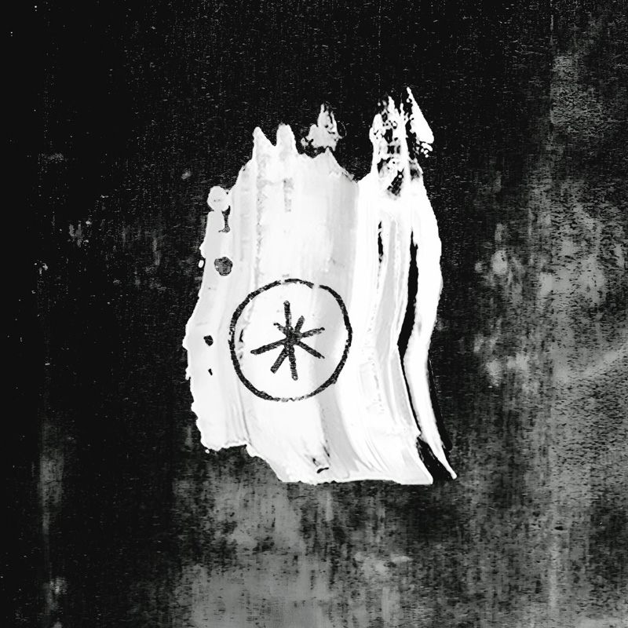

+++
date = '2025-03-04T18:30:17+01:00'
draft = false
title = 'Heartworms - Glutton For Punishment - 2025'
categories = ['New']
tags = ['Rock', 'Post Punk']
image = '/images/heartworms-glutton-for-punishment.jpg'
year = 1995
+++

Cette année, j'ai enfin fait une véritable découverte musicale. Je n'avais jamais entendu parler de ce groupe avant de voir son nom sur l'affiche de la collection hiver de La Route du Rock. En cherchant plus d'informations, j'ai découvert que de nombreux blogs avaient mentionné cet album de manière élogieuse. Intrigué, j'ai décidé de l'écouter, et j'ai bien fait. Depuis, je le réécoute régulièrement avec beaucoup de plaisir.

Heartworms n'est pas un groupe à proprement parler, mais le projet solo de Josephine Orme, née à la fin des années 90 à Londres. Après un premier EP sorti en 2023, "Glutton For Punishment" est son premier album. Ce disque suit logiquement les excellents singles "Jacked" et "Warplane", qui restent les pierres angulaires de l'album. C'est peut-être le seul point de déception de cet album, qui ne propose pas, à mon avis, de titres aussi percutants que ces deux premiers singles.

Si je devais classer cet album, je le rangerais dans la catégorie du post-punk, bien que certains morceaux flirtent avec l'électro ou la new wave. J'apprécie particulièrement l'atmosphère froide et chirurgicale qui s'en dégage. Les références musicales abondent, mais cela n'enlève rien à la singularité de ce disque. Ce qui m'a surtout frappé, ce sont les similitudes avec PJ Harvey au niveau du chant. Billie Eilish n'est pas très loin non plus, pour citer des références plus contemporaines.

Ce disque va certainement m'accompagner dans les mois à venir. J'espère pouvoir assister à un concert lors d'une éventuelle tournée en France ou à une apparition dans un festival cet été.

[Discogs](https://www.discogs.com/fr/artist/11743361-Heartworms-4)


