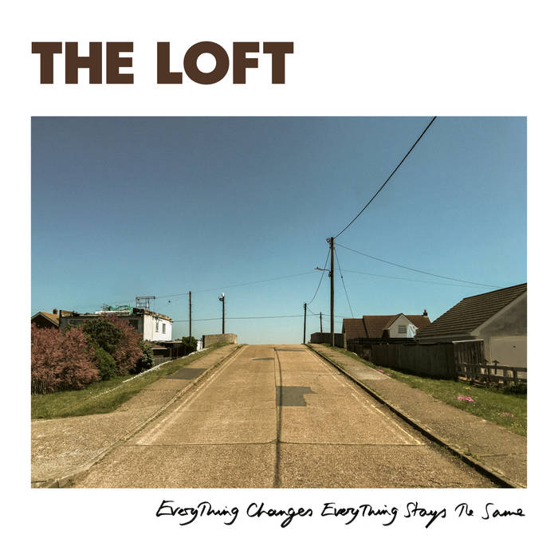

+++
date = '2025-03-22T18:30:17+01:00'
draft = false
title = 'The Loft - Everything Changes, Everything Stays The Same - 2025'
categories = ['New']
tags = ['Indie Rock', 'Jangle Pop']
image = '/images/the-loft-everything-changes-everything-stays-the-same.jpg'
year = 2025
+++

J'étais parti sur un bon rythme depuis le début de l'année, mais je dois me rendre à l'évidence qu'il n'est pas facile de le soutenir indéfiniment. Je reviens aux affaires avec un disque sorti récemment et qu'on pourra donc qualifier de "nouveauté". D'emblée, je peux assurer qu'il ne figurera pas dans mon classement de fin d'année, mais ce disque vient tranquillement marquer mon début d'année musicale pour plusieurs raisons.

Tout d'abord, c'est la pochette qui m'a incité à jeter une oreille sur cet album. En effet, la pochette du disque présente une très belle photo mise en valeur par le cadre blanc. Cette pochette me rappelle une autre réussite visuelle de ce début d'année, l'album de Chris Eckman que j'ai chroniqué il y a quelque temps.

Ensuite, il y a le groupe lui-même ! The Loft, c'est le groupe qui a sévi au début des années 80 avec à sa tête Peter Astor. J'avoue que j'ai suivi d'une oreille plutôt distraite son parcours musical, que ce soit en solo ou avec les Weather Prophets. Ce qui a piqué ma curiosité, c'est que ce disque est en réalité le premier véritable album du groupe, 45 ans après leurs débuts !

Mais au-delà de ces anecdotes, il y a de la musique à découvrir, et je dois dire que l'ensemble est plutôt agréable. Des mélodies accrocheuses et des pop songs bien écrites, lumineuses, qui ne perdent pas de leur charme au fil des écoutes. C'est une belle surprise qui marque un retour réussi après 40 années d'absence. Et qui sait, peut-être n'aurons-nous pas à attendre 40 ans pour un deuxième album !

[Discogs](https://www.discogs.com/fr/master/3784928-The-Loft-Everything-Changes-Everything-Stays-The-Same)


