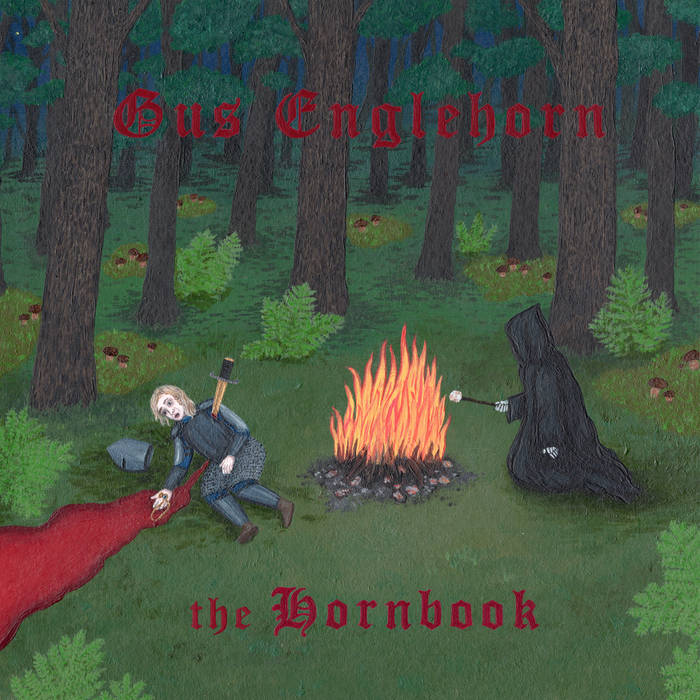

+++
date = '2025-03-26T18:30:17+01:00'
draft = true
title = 'Gus Englehorn - The Hornbook - 2025'
categories = ['New']
tags = ['Folk','Art Rock']
image = '/images/gus-englehorn-the-hornbook.jpg'
year = 2025
+++

Parmi les nombreuses satisfactions que la musique peut m'apporter, la découverte d'un artiste en première partie d'un concert occupe une place de choix. Le plaisir est immense de voir sur scène un artiste pour moi inconnu, qui parvient à éclipser la tête d'affiche pour laquelle j'avais réservé ma soirée. En 2013, H-Burns, qui ouvrait pour Bertrand Belin à l'Épicerie Moderne, m'avait déjà offert ce petit bonheur. Cette fois-ci, toujours à l'Épicerie Moderne, le 25 mars 2025, c'est Gus Englehorn qui a surgi dans mon paysage musical à l'occasion du concert de Porridge Radio.

Pendant 40 minutes, Gus Englehorn a su m'attirer dans son univers, introduisant chacun de ses titres par quelques explications loufoques dans un français approximatif. Au-delà de son accent, c'est surtout la gentillesse et la fragilité du personnage qui nous transportent dans son monde empreint de poésie.

De retour du concert, j'ai parcouru les différents articles disponibles sur cet artiste pour découvrir les multiples vies de la star du jour. Avant de se consacrer à la musique, Gus Englehorn a parcouru le monde en tant que snowboarder professionnel. Originaire de l'Alaska, il s'est ensuite tourné vers la musique avec sa compagne québécoise, qui l'accompagne à la batterie.

Ainsi, en ce début d'année 2025, sort le troisième album de Gus Englehorn. Il s'inscrit dans la lignée des deux précédents. À l'écoute du disque, on pense forcément à Daniel Johnston, une référence assumée, mais aussi à Frank Black, les Pixies ou même Pavement. Les neuf chansons de l'album sont autant de mélodies imparables, illustrant des paroles poétiques et mystérieuses.

Voilà donc une belle découverte qui risque de tourner régulièrement sur ma platine dans les prochains mois, en attendant de nouvelles productions de ce garçon si attachant.

[Discogs](https://www.discogs.com/fr/master/3748356-Gus-Englehorn-The-Hornbook)


