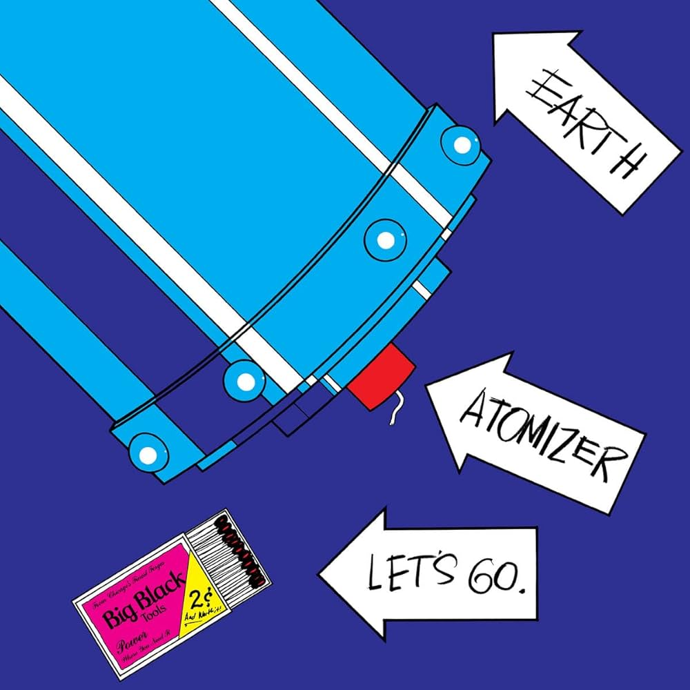

+++
date = '2025-02-16T18:30:17+01:00'
draft = false
title = 'Big Black - Atomizer - 1986'
categories = ['Discovery']
tags = [' Noise Rock', 'Post Punk']
image = '/images/big-black-atomizer.jpg'
+++

Un peu de noise dans ces pages ne va pas me faire de mal ! Pendant longtemps, je n'ai connu qu'une facette de Steve Albini, celle du producteur. Je portais toujours une oreille attentive aux disques qu'il produisait, tant il avait façonné le son de certains de mes albums favoris. Je pense notamment à Seamonsters de The Wedding Present, Rid Of Me de PJ Harvey, Surfer Rosa des Pixies... De véritables monuments qui ont marqué l'histoire de la musique et qui ont usé ma platine.

Certes, j'avais entendu parler des groupes dans lesquels il avait sévi, mais je n'avais jamais fait l'effort de les écouter attentivement. Par curiosité, je me suis rendu à un concert de Shellac en 2012 à l'Épicerie Moderne. C'est lors de cette soirée que j'ai réellement découvert le son de Steve Albini. J'ai ensuite suivi la carrière de Shellac sans pour autant explorer la discographie antérieure d'Albini.

Ce n'est qu'il y a quelques jours, au gré des propositions de Spotify, que je me suis lancé dans l'écoute du premier album de Big Black, son groupe initial. Et là, je dois le dire, j'ai été conquis dès la première écoute. On y retrouve déjà le son qui définit sa marque de fabrique de producteur, mais ce qui m'a le plus surpris, c'est la subtilité présente sur chaque morceau. Au-delà du son abrasif et métallique, cet album regroupe de vraies chansons qui ont immédiatement accroché mon oreille. J'ai d'ailleurs enchaîné avec le deuxième album du groupe, le bien nommé "Songs About Fucking", avec sa reprise très personnelle du titre "The Model" de Kraftwerk. 

Cette découverte tardive me rappelle qu'il reste toujours des trésors à dénicher, même après des années d'écoute assidue. Malgré ma longue expérience musicale, je suis régulièrement étonné de passer à côté de groupes essentiels, ce qui me laisse penser que de nombreuses pépites m'attendent encore.

[Discogs](https://www.discogs.com/fr/master/6398-Big-Black-Atomizer)


